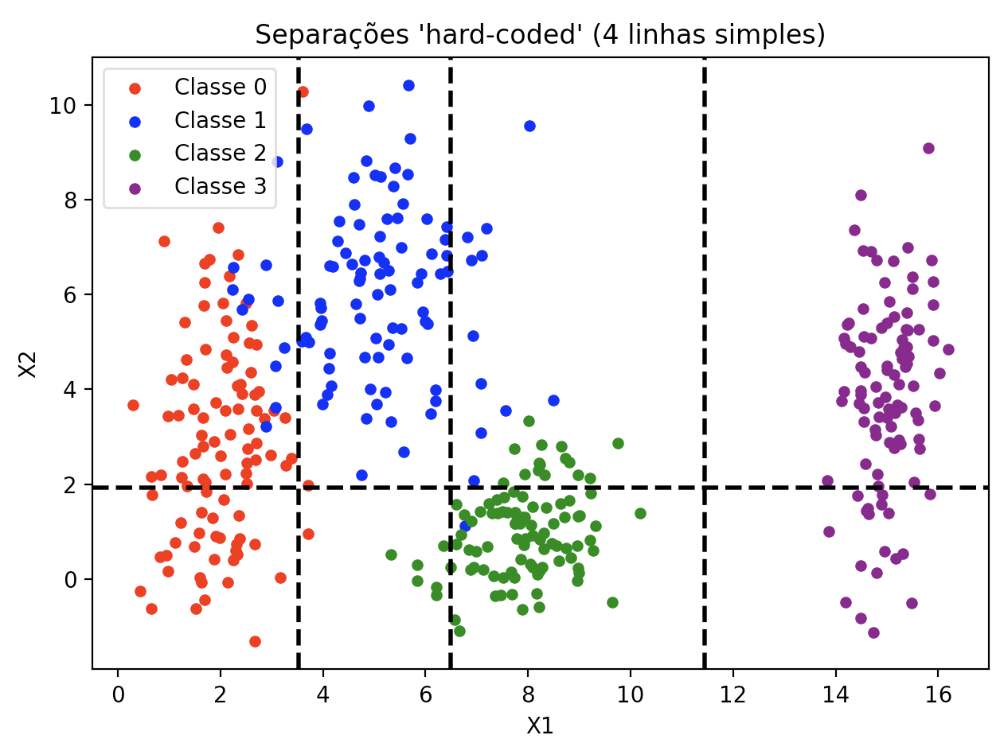
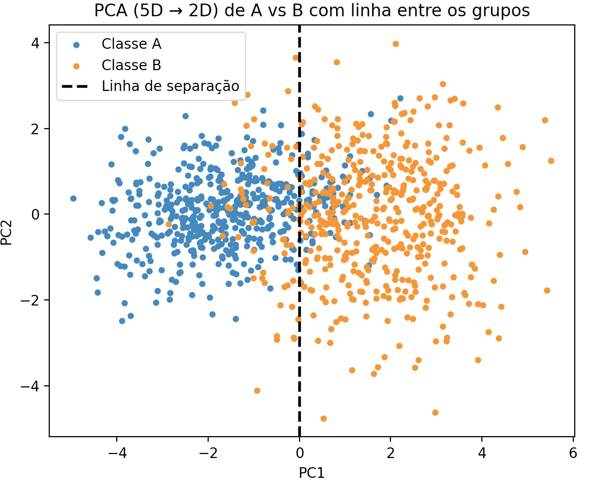
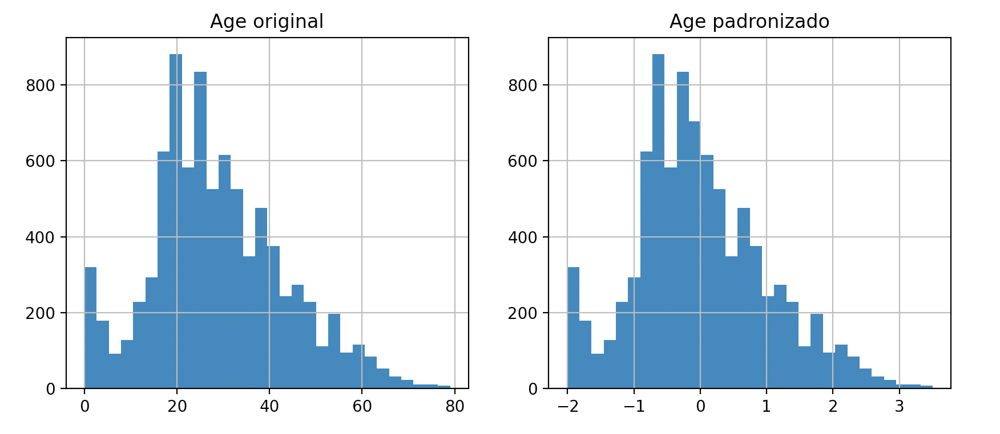

# Deep Learning — Atividade 1


## Exercício 1 — Exploring Class Separability in 2D

**Objetivo.** Gerar 400 exemplos de 4 datasets sinteticos, plotar seus dados e fazer uma fronteiras linear.

**Como fiz**
- Gerei 400 pontos com `numpy.random.normal` usando as médias e desvios do enunciado.
- Plotei os dados em scatter.
- Desenhei linhas simples para sugerir possíveis fronteiras.

**Codigo que usei:**
```python
import numpy as np
import matplotlib.pyplot as plt

rng = np.random.default_rng(42)
n = 100 

# dados
class0 = rng.normal([2, 3], [0.8, 2.5], (n, 2))
class1 = rng.normal([5, 6], [1.2, 1.9], (n, 2))
class2 = rng.normal([8, 1], [0.9, 0.9], (n, 2))
class3 = rng.normal([15, 4], [0.5, 2.0], (n, 2))

# scatter
plt.scatter(class0[:,0], class0[:,1], c='red',   s=18, label='Classe 0')
plt.scatter(class1[:,0], class1[:,1], c='blue',  s=18, label='Classe 1')
plt.scatter(class2[:,0], class2[:,1], c='green', s=18, label='Classe 2')
plt.scatter(class3[:,0], class3[:,1], c='purple',s=18, label='Classe 3')

# centróides
means = np.array([
    class0.mean(axis=0),
    class1.mean(axis=0),
    class2.mean(axis=0),
    class3.mean(axis=0),
])

# 3 verticais: pontos médios no eixo X
x01 = (means[0,0] + means[1,0]) / 2
x12 = (means[1,0] + means[2,0]) / 2
x23 = (means[2,0] + means[3,0]) / 2
plt.axvline(x01, color='k', linestyle='--', linewidth=2)
plt.axvline(x12, color='k', linestyle='--', linewidth=2)
plt.axvline(x23, color='k', linestyle='--', linewidth=2)

# 1 horizontal: ponto médio no eixo Y
y02 = (means[0,1] + means[2,1]) / 2
plt.axhline(y02, color='k', linestyle='--', linewidth=2)

plt.legend(loc='best')
plt.xlabel("X1")
plt.ylabel("X2")
plt.title("Separações 'hard-coded' (4 linhas simples)")
plt.tight_layout()
plt.show()

```
**Perguntas:**
a. Examine the scatter plot carefully. Describe the distribution and overlap of the four classes.
Classe 1: canto inferior esquerdo, maior variação em Y.
Classe 2: acima/à esquerda, sobrepõe parcialmente a Classe 0 na diagonal.
Classe 3: região central-direita e mais baixa em Y, pequena sobreposição com a Classe 1.
Classe 4: bem à direita, quase isolada das demais.

b. Based on your visual inspection, could a simple, linear boundary separate all classes?
Não. Uma única reta divide o plano em duas regiões. Com quatro classes e ainda com overlap entre algumas delas, não é possível separar tudo perfeitamente com uma única fronteira linear.

c. 


---

## Exercício 2 — Non-Linearity in Higher Dimensions (5D → PCA 2D)

**Objetivo.** Gerar 1000 amostras de 2 classes, plotar seus dados e fazer uma fronteiras linear.

**Como fiz.**
- Gerei 500 amostras para A e 500 para B com as médias e covariâncias dadas.
- Centralizei os dados.
- Plotei a projeção e acrescentei uma **linha simples** de separação no plano.

**Codigo que usei:**
```python
import numpy as np
import matplotlib.pyplot as plt

rng = np.random.default_rng(42)

# ---------- 1) Dados 5D ----------
n = 500

mu_A = np.array([0, 0, 0, 0, 0], dtype=float)
Sigma_A = np.array([
    [1.0, 0.8, 0.1, 0.0, 0.0],
    [0.8, 1.0, 0.3, 0.0, 0.0],
    [0.1, 0.3, 1.0, 0.5, 0.0],
    [0.0, 0.0, 0.5, 1.0, 0.2],
    [0.0, 0.0, 0.0, 0.2, 1.0],
])

mu_B = np.array([1.5, 1.5, 1.5, 1.5, 1.5], dtype=float)
Sigma_B = np.array([
    [1.5, -0.7, 0.2, 0.0, 0.0],
    [-0.7, 1.5, 0.4, 0.0, 0.0],
    [0.2, 0.4, 1.5, 0.6, 0.0],
    [0.0, 0.0, 0.6, 1.5, 0.3],
    [0.0, 0.0, 0.0, 0.3, 1.5],
])

A = rng.multivariate_normal(mu_A, Sigma_A, size=n)
B = rng.multivariate_normal(mu_B, Sigma_B, size=n)

X = np.vstack([A, B])
y = np.array([0]*n + [1]*n) 

Xc = X - X.mean(axis=0, keepdims=True)
U, S, Vt = np.linalg.svd(Xc, full_matrices=False)
V = Vt.T
Z = Xc @ V[:, :2]   # (1000, 2)

# ---------- 2) Linha entre os grupos ----------
# pega a média de PC1 para cada classe
mA = Z[y==0,0].mean()
mB = Z[y==1,0].mean()
x_sep = (mA + mB) / 2  # ponto médio no eixo X

# ---------- 3) Plot ----------
plt.figure(figsize=(6,5))
plt.scatter(Z[y==0, 0], Z[y==0, 1], s=12, label="Classe A")
plt.scatter(Z[y==1, 0], Z[y==1, 1], s=12, label="Classe B")

# linha vertical separando
plt.axvline(x=x_sep, color='k', linestyle='--', linewidth=2, label="Linha de separação")

plt.xlabel("PC1")
plt.ylabel("PC2")
plt.title("PCA (5D → 2D) de A vs B com linha entre os grupos")
plt.legend()
plt.tight_layout()
plt.show()
```


**Perguntas:**
a. Based on your 2D projection, describe the relationship between the two classes.
Na projeção 2D do PCA, as duas classes formam nuvens elípticas. A classe B fica mais à direita e a classe A mais à esquerda, em PC2 as médias são parecidas.

b. Discuss the linear separability of the data. Explain why this type of data structure poses a challenge for simple linear models and would likely require a multi-layer neural network with non-linear activation functions to be classified accurately.

Não dá para separar perfeitamente com uma fronteira linear, a projeção pode misturar um pouco as classes. Por isso, um modelo linear simples não basta. Mas da pra separar melhor do que no exercicio 1.

**Imagem exercicio 2**



---

## Exercício 3 — Preprocessamento (Spaceship Titanic)

**Objetivo do dataset:** Prever `Transported` (True/False) para cada passageiro, que indica se o passageiro foi transportado para outra dimensão.

**Tipos de variáveis.**
**Numéricas:** `Age`, `RoomService`, `FoodCourt`, `ShoppingMall`, `Spa`, `VRDeck` e `CabinNum`.
**Categóricas:** `HomePlanet`, `CryoSleep`, `Destination`, `VIP`, `Deck`, `Side`, `Name`.
**Identificador:** `PassengerId`.


**Missing data:**
HomePlanet, CryoSleep, Cabin, Destination, Age, VIP, RoomService, FoodCourt, ShoppingMall, Spa, VRDeck, Name. Essas sao as colunas que tem dados faltando, com mais ou menos 8000 linhas faltando. Para as variáveis numéricas eu preenchi elas com a mediana da coluna, para as variáveis categóricas, substituí por uma categoria específica.

**Boa pratica em Normalize/Standardize Numerical Features:**
Isso é bom para redes com tanh porque a ativação é centrada em zero e funciona melhor quando as entradas também estão centradas.


```python
import pandas as pd
import numpy as np
import matplotlib.pyplot as plt
from sklearn.model_selection import train_test_split
from sklearn.preprocessing import StandardScaler

# ---------- 1. Carregar dados ----------
train = pd.read_csv("train.csv")

# ---------- 2. Tratar clunas ----------
# Separar alvo
y = train["Transported"].astype(int)  # True/False -> 1/0
X = train.drop(columns=["Transported", "PassengerId", "Name"])

# Dividir Cabin em 3 partes (Deck, Num, Side)
cabin_split = X["Cabin"].str.split("/", expand=True)
X["Deck"] = cabin_split[0]
X["CabinNum"] = pd.to_numeric(cabin_split[1], errors="coerce")
X["Side"] = cabin_split[2]
X = X.drop(columns=["Cabin"])

# ---------- 3. Tratar data faltando ----------
for col in X.select_dtypes(include=["float64", "int64"]).columns:
    X[col] = X[col].fillna(X[col].median())
for col in X.select_dtypes(include=["object", "bool"]).columns:
    X[col] = X[col].fillna("Missing")

# ---------- 4. One-hot encoding ----------
X = pd.get_dummies(X, drop_first=True)

# ---------- 5. Normalização ----------
scaler = StandardScaler()
num_cols = ["Age", "RoomService", "FoodCourt", "ShoppingMall", "Spa", "VRDeck", "CabinNum"]
X[num_cols] = scaler.fit_transform(X[num_cols])

# ---------- 6. Visualização ----------
fig, axes = plt.subplots(1,2, figsize=(10,4))
train["Age"].hist(ax=axes[0], bins=30)
axes[0].set_title("Age original")
X["Age"].hist(ax=axes[1], bins=30)
axes[1].set_title("Age padronizado")
plt.show()

print("final:", X.shape)

```

**Imagem exercicio 3**


